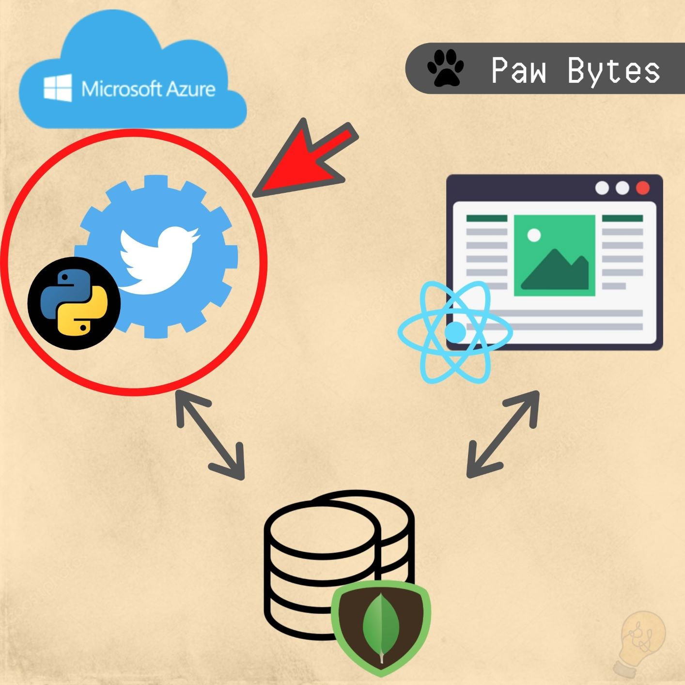
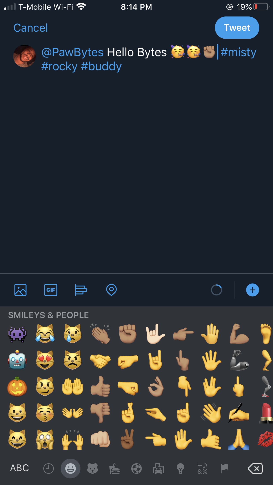
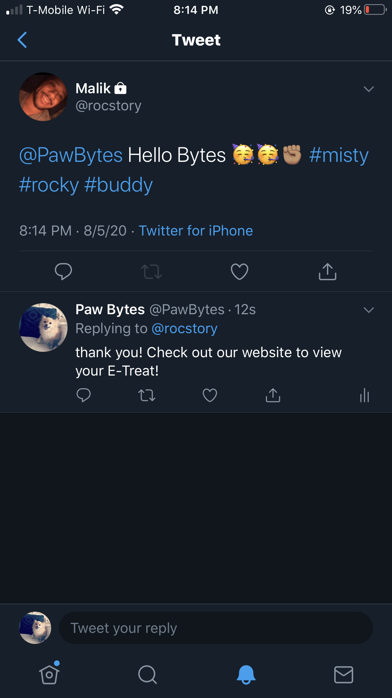

# Paw Bytes Twitter Bot
The Twitter Bot was designed to be an extension of the Paw Bytes Restaurant which allows customers to leave compliments (treats) to their favorite Paw Pals.

Paw Bytes Twitter Bot interacts with it's customers on the social media platform, Twitter. Customers are able to leave compliments (e-treats) to any of our Paw Pals. The Twitter bot collects tweets which mentions one or more Paw Pals and stores it within the Paw Bytes database.

## Twitter Bot
- Twitter bot account name: [@PawBytes](https://twitter.com/PawBytes)
- The Twitter bot is developed using Python.

### How it works
- To interact with the Twitter Bot, mention @PawBytes in a tweet with the hashtag of the Paw Pal that you would like to tweet at. See table below for some of the Paw Pals and their associated hashtag.
- Once the tweet has been made the Twitter Bot will then store the tweet into the database and reply back with a thank you message.

| Paw Pal       | Hashtag       |
| ------------- |:-------------:|
| Misty         | #misty        |
| Carson        | #carson       |
| Blue          | #blue         |
| Rocky         | #rocky        |
| Buddy         | #buddy        |

### 1 Tweet at Paw Bot
- Tweet at Paw Bot with any of the hashtags associated with a Paw Pal

### 2 Paw Bot replies
- Paw Bot parses the tweet, checks if a Paw Pal has been mentioned and stores it into the database.
-  Paw Bot then replies back to the user with a thank you message and a prompt to check the Paw Bytes webpage to view their etreat.

## Project Status
- This project is complete.

## Future implementation
- Adding a function to reject tweets that contain any malicious or negative materials in it.

- Improving the response given by Paw Bot.

- Creating unit tests

## Current Bugs
- There are currently no bugs as of 8/5/2020

## Reflection
Developing the Paw Bytes Twitter Bot with Python was a fun experience! Taking on this project has helped me gain a better understanding of Python.

## Collaborators
There are currently no collaborators on this project as of 8/5/2020

